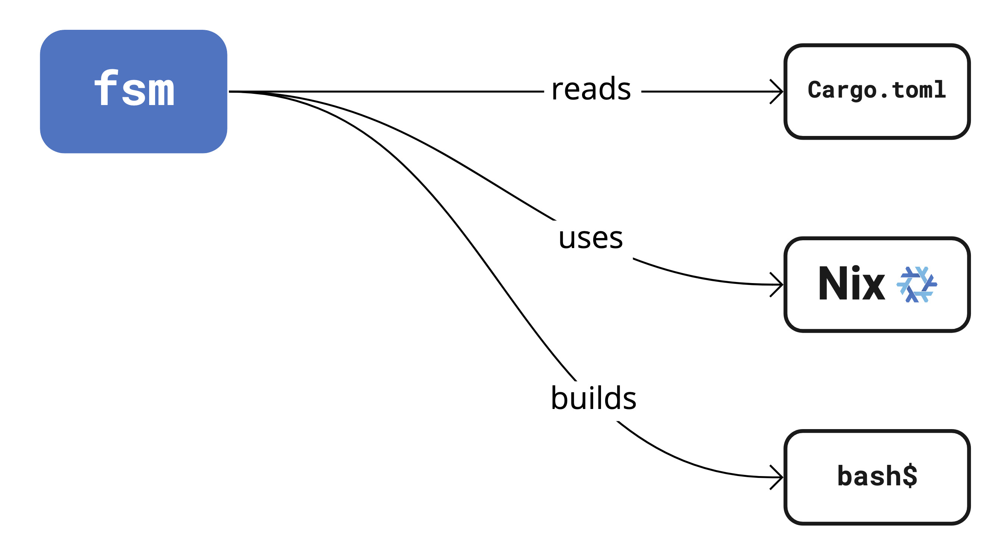

# fsm

fsm (Flying Spaghetti Monster) is a tool that automatically provides external
dependencies[^1] for software projects. To enter a shell environment with all
your project's external dependencies installed, run this at the project root:

```shell
fsm shell
```

fsm currently supports [Rust] with support for other languages coming soon. It
uses the [Nix] package manager to handle dependencies but doesn't require you to
know or use Nix.

## Requirements

To use fsm, you need to install these binaries on your system:

* [`nix`][nix-install]
* [`cargo`][rust-install]

## Installation

TODO: download the statically linked binary
### Via Nix

To install fsm using Nix:

```shell
# With flakes enabled
nix profile install github:DeterminateSystems/fsm

# Using channels
nix-channel --add https://github.com/DeterminateSystems/fsm/archive/main.tar.gz
nix-channel --update
nix-env -i fsm
```

## What fsm provides

Languages typically use language-specific package managers to handle
dependencies, such as [Cargo] for the [Rust] language. But these
language-specific tools typically don't handle dependencies written in other
languages very well. They expect you to install those dependencies using some
other tool and fail in mysterious ways when they're missing, like this:

```rust
   Compiling openssl-sys v0.9.75
error: failed to run custom build command for `openssl-sys v0.9.75`
  run pkg_config fail: "`\"pkg-config\" \"--libs\" \"--cflags\"
    \"openssl\"` did not exit successfully: \n... No package 'openssl' found\n"
```

It's then up to you to install the missing dependencies, which can be laborious,
error prone, and hard to reproduce.

fsm offers a way out of this. It uses your project's language-specific
configuration to infer which dependencies are required&mdash;or you can [declare
them](#how-to-declare-package-inputs) if necessary&mdash;and creates a shell
environment with all of those dependencies both installed and properly linked.

These environments are *transient* in the sense that they don't affect anything
outside the shell; they install dependencies neither globally nor in your
current project, so you don't have to worry about fsm breaking anything on your
system. When you exit the fsm shell, the dependencies are gone.

## Example usage

In this example, we'll build the [Prost] project from source. Prost has an
external dependency on [OpenSSL], without which commands like `cargo build` and
`cargo run` are doomed to fail. fsm provides those dependencies automatically,
without you needing to install them in your regular environment. Follow these
steps to see dependency inference in action:

```shell
git clone https://github.com/tokio-rs/prost.git
cd prost

# Enter the fsm shell environment
fsm shell
# ✓ 🦀 rust: cargo, cmake, curl, openssl, pkg-config, rustc, rustfmt, zlib

# Check for the presence of openssl
which openssl
# The path should look like this:
# /nix/store/f3xbf94zykbh6drw6wfg9hdrfgwrkck7-openssl-1.1.1q-bin/bin/openssl
# This means that fsm is using the Nix-provided openssl

# Build the project
cargo build

# Leave the shell environment
exit

# Check for openssl again
which openssl
# This should either point to an openssl executable on your PATH or fail
```

## How to declare package inputs

While fsm does its best to infer external dependencies from your project's crate
dependencies, you can explicitly declare external dependencies if necessary by
adding an `fsm` block to the `package.metadata` block in your `Cargo.toml`. fsm
currently supports three types of inputs:

* `build-inputs` are external dependencies that some crates may need to link
  against.
* `environment-variables` are environment variables you want to set in your dev
  shell.
* `runtime-inputs` are libraries you want to add to your `LD_LIBRARY_PATH` to
  ensure that your dev shell works as expected.

Both `build-inputs` and `runtime-inputs` can be any executable available in
[Nixpkgs].

Here's an example `Cargo.toml` with explicitly supplied fsm configuration:

```toml
[package]
name = "fsm-example"
version = "0.1.0"
edition = "2021"

[package.metadata.fsm]
build-inputs = [ "openssl" ]
runtime-inputs = [ "libGL" ]

[package.metadata.fsm.environment-variables]
HI = "BYE"

# Other configuration
```

When you run `fsm shell` in this project, fsm

* adds [OpenSSL] to your build environment
* sets the `LD_LIBRARY_PATH` environment variable to include [LibGL]'s library
  path
* sets the `HI` environment variable to have a value of `BYE`

### macOS framework dependencies

macOS users working with Rust often struggle with so-called framework
dependencies, such as [`Foundation`][foundation],
[`CoreServices`][coreservices], and [`Security`][security]. You may have
encountered error messages like this when using Rust:

```
= note: ld: framework not found CoreFoundation
```

You can overcome this problem by adding framework dependencies to your
`build-inputs` as `darwin.apple_sdk.frameworks.${framework}`, for example
`darwin.apple_sdk.frameworks.Security`. Here's an example `Cargo.toml`
configuration that adds multiple framework dependencies:

```toml
[package.metadata.fsm]
build-inputs = [
  "darwin.apple_sdk.frameworks.CoreServices"
  "darwin.apple_sdk.frameworks.Security",
]
```

## How it works

When you run `fsm shell` in a Rust project, fsm

- **reads** your [`Cargo.toml`][cargo-toml] configuration manifest to determine
  which external dependencies your project requires and then
- **uses** the [Nix] package manager&mdash;in the background and without
  requiring any intervention on your part&mdash;to install any external
  dependencies, such as [OpenSSL] or [Protobuf], and also sets any environment
  variables necessary to discover those tools. Once it knows which external
  tools are required, it
- **builds** a custom shell environment that enables you to use commands like
  `cargo build` and `cargo run` without encountering the missing dependency
  errors that so often dog Rust development.

This diagram provides a basic visual description of that process:

<!-- Image editable at: https://miro.com/app/board/uXjVPdUOswQ=/ -->
<p align="center">
  
</p>

Because fsm uses Nix, all of the dependencies that it installs are stored in
your local [Nix store], by default under `/nix/store`.

[cargo]: https://doc.rust-lang.org/cargo
[cargo-toml]: https://doc.rust-lang.org/cargo/reference/manifest.html
[coreservices]: https://developer.apple.com/documentation/coreservices
[foundation]: https://developer.apple.com/documentation/foundation
[libgl]: https://dri.freedesktop.org/wiki/libGL
[nix]: https://nixos.org/nix
[nix-install]: https://nixos.org/download.html
[nixpkgs]: https://search.nixos.org/packages
[nix store]: https://nixos.wiki/wiki/Nix_package_manager
[openssl]: https://openssl.org
[protobuf]: https://developers.google.com/protocol-buffers
[rust]: https://rust-lang.org
[rust-install]: https://www.rust-lang.org/tools/install
[security]: https://developer.apple.com/documentation/security

[^1]: We define **external** dependencies as those that are written in another
  language and thus can't be installed using the same language-specific package
  manager that you use to build your code.
