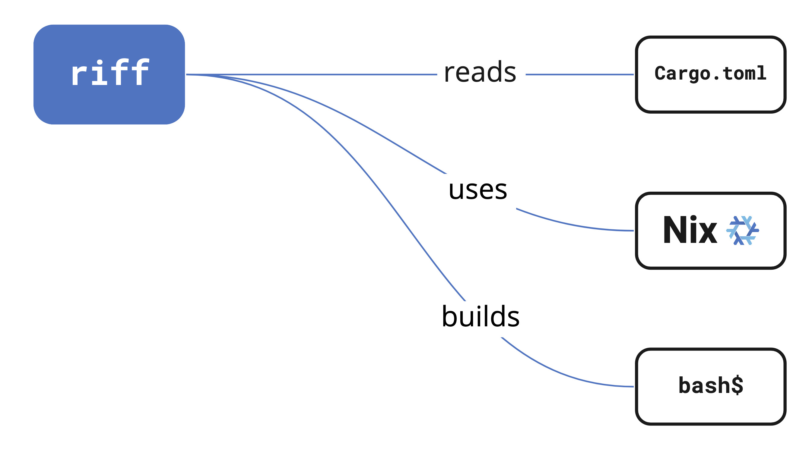

# Riff


**Riff** is a tool that automatically provides external dependencies[^1] for
software projects. To enter a shell environment with all your project's external
dependencies installed, run this at the project root:

```shell
riff shell
```

You can also directly run commands as if the shell environment were in place:

```shell
riff run cargo build
```

Riff currently supports [Rust] with support for other languages coming soon. It
uses the [Nix] package manager to handle dependencies but doesn't require you to
know or use Nix.

> For a video demo of Riff in action, see [below](#video-demo).

## Requirements

To use Riff, you need to install these binaries on your system:

* [`nix`][nix-install]
* [`cargo`][rust-install]

## Installation

TODO: download the statically linked binary

### Via Nix

To install Riff using Nix (make sure to have [flakes] enabled):

```shell
nix profile install github:DeterminateSystems/riff
```

## What Riff provides

Languages typically use language-specific package managers to handle
dependencies, such as [Cargo] for the [Rust] language. But these
language-specific tools typically don't handle dependencies written in other
languages very well. They expect you to install those dependencies using some
other tool and fail in mysterious ways when they're missing. Here's an example
error from trying to build the [`octocrab`][octocrab] crate without [OpenSSL]
installed:

```shell
--- stderr
thread 'main' panicked at '

Could not find directory of OpenSSL installation, and this `-sys` crate cannot
proceed without this knowledge. If OpenSSL is installed and this crate had
trouble finding it,  you can set the `OPENSSL_DIR` environment variable for the
compilation process.

Make sure you also have the development packages of openssl installed.
For example, `libssl-dev` on Ubuntu or `openssl-devel` on Fedora.
```

In cases like this, it's up to you to install missing external dependencies,
which can be laborious, error prone, and hard to reproduce.

Riff offers a way out of this. It uses your project's language-specific
configuration to infer which dependencies are required&mdash;or you can [declare
them](#how-to-declare-package-inputs) if necessary&mdash;and creates a shell
environment with all of those dependencies both installed and properly linked.

These environments are *transient* in the sense that they don't affect anything
outside the shell; they install dependencies neither globally nor in your
current project, so you don't have to worry about Riff breaking anything on your
system. When you exit the Riff shell, the dependencies are gone.

## Example usage

In this example, we'll build the [Prost] project from source. Prost has an
external dependency on [OpenSSL], without which commands like `cargo build` and
`cargo run` are doomed to fail. Riff provides those dependencies automatically,
without you needing to install them in your regular environment. Follow these
steps to see dependency inference in action:

```shell
git clone https://github.com/tokio-rs/prost.git
cd prost

# Enter the Riff shell environment
riff shell
# ✓ 🦀 rust: cargo, cmake, curl, openssl, pkg-config, rustc, rustfmt, zlib

# Check for the presence of openssl
which openssl
# The path should look like this:
# /nix/store/f3xbf94zykbh6drw6wfg9hdrfgwrkck7-openssl-1.1.1q-bin/bin/openssl
# This means that Riff is using the Nix-provided openssl

# Build the project
cargo build

# Leave the shell environment
exit

# Check for openssl again
which openssl
# This should either point to an openssl executable on your PATH or fail
```

## How to declare package inputs

While Riff does its best to infer external dependencies from your project's
crate dependencies, you can explicitly declare external dependencies if
necessary by adding a `riff` block to the `package.metadata` block in your
`Cargo.toml`. Riff currently supports three types of inputs:

* `build-inputs` are external dependencies that some crates may need to link
  against.
* `environment-variables` are environment variables you want to set in your dev
  shell.
* `runtime-inputs` are libraries you want to add to your `LD_LIBRARY_PATH` to
  ensure that your dev shell works as expected.

Both `build-inputs` and `runtime-inputs` can be any packages available in
[Nixpkgs].

Here's an example `Cargo.toml` with explicitly supplied Riff configuration:

```toml
[package]
name = "riff-example"
version = "0.1.0"
edition = "2021"

[package.metadata.riff]
build-inputs = [ "openssl" ]
runtime-inputs = [ "libGL" ]

[package.metadata.riff.environment-variables]
HI = "BYE"

# Other configuration
```

When you run `riff shell` in this project, Riff

* adds [OpenSSL] to your build environment
* sets the `LD_LIBRARY_PATH` environment variable to include [libGL]'s library
  path
* sets the `HI` environment variable to have a value of `BYE`

### Target specific dependencies

If a project has OS, architecture, or vendor specific dependencies, you can
configure the metadata of `riff` like so:

```toml
[package.metadata.riff.targets.aarch64-apple-darwin]
build-inputs = [
  "darwin.apple_sdk.frameworks.CoreServices",
  "darwin.apple_sdk.frameworks.Security"
]
```

The Rust project maintains [a list of well-known targets
](https://doc.rust-lang.org/nightly/rustc/platform-support.html)
which can also be accessed via `nix run nixpkgs#rustup target list`. This
field can also contain custom targets, such as `riscv32imac-unknown-xous-elf`,
though `riff` makes no efforts to support cross compiling at this time.

When target specific dependencies are present, the `build-inputs` and
`runtime-inputs` sections are **unioned** (joined), while the target specific
environment variables **override** default environment variables.

#### macOS framework dependencies

macOS users may encounter issues with 'framework dependencies', such as
[`Foundation`][foundation], [`CoreServices`][coreservices], and
[`Security`][security].

You may encounter error messages like this:

```
= note: ld: framework not found CoreFoundation
```

You can solve this by adding framework dependencies to your `build-inputs` as
`darwin.apple_sdk.frameworks.<framework>`, for example
`darwin.apple_sdk.frameworks.Security`. Here's an example `Cargo.toml`
configuration that adds multiple framework dependencies:

```toml
[package.metadata.riff.targets.x86_64-apple-darwin]
build-inputs = [
  "darwin.apple_sdk.frameworks.CoreServices",
  "darwin.apple_sdk.frameworks.Security"
]

[package.metadata.riff.targets.aarch64-apple-darwin]
build-inputs = [
  "darwin.apple_sdk.frameworks.CoreServices",
  "darwin.apple_sdk.frameworks.Security"
]
```

## How it works

When you run `riff shell` in a Rust project, Riff

- **reads** your [`Cargo.toml`][cargo-toml] configuration manifest to determine
  which external dependencies your project requires and then
- **uses** the [Nix] package manager&mdash;in the background and without
  requiring any intervention on your part&mdash;to install any external
  dependencies, such as [OpenSSL] or [Protobuf], and also sets any environment
  variables necessary to discover those tools. Once it knows which external
  tools are required, it
- **builds** a custom shell environment that enables you to use commands like
  `cargo build` and `cargo run` without encountering the missing dependency
  errors that so often dog Rust development.

This diagram provides a basic visual description of that process:

<!-- Image editable at: https://miro.com/app/board/uXjVPdUOswQ=/ -->
<p align="center">
  
</p>

Because Riff uses Nix, all of the dependencies that it installs are stored in
your local [Nix store], by default under `/nix/store`.

## Video demo

You can see a video demo of Riff in action here (click on the image for a
larger version):

<p align="center">
  
</p>

In the video, running `cargo build` in the [Prost] project fails due to missing
external dependencies. But running `riff run cargo build` succeeds because Riff
is able to infer which external dependencies are missing and provide them in the
background using Nix.

## Direnv Integration

You can add Riff support to Direnv on a project specific or global basis.

On a project specific basis, you can create `.envrc` with the following:

```bash
# reload when these files change
watch_file Cargo.toml
watch_file Cargo.lock
# add any other files you might want to trigger a riff reload
# load the riff dev env
eval "$(riff print-dev-env)"
```

Enable Riff support globally by creating `~/.config/direnv/lib/riff.sh` and
adding the following contents:

```bash
use_riff() {
  # reload when these files change
  watch_file Cargo.toml
  watch_file Cargo.lock
  # load the riff dev env
  eval "$(riff print-dev-env)"
}
```

Then, in any directory you can enable riff with:

```bash
echo "use riff" > .envrc
```

## Privacy policy

For the sake of improving the tool, Riff does collect some [telemetry] from
users. You can read the full privacy policy for [Determinate Systems], the
creators of Riff, [here][privacy].

To disable telemetry on any Riff command invocation, you can either

* Use the `--disable-telemetry` flag or
* Set the `RIFF_DISABLE_TELEMETRY` environment variable to any value except
  `false`,`0`, or an empty string (`""`).

Here are some examples:

```shell
riff shell --disable-telemetry
RIFF_DISABLE_TELEMETRY=true riff run cargo build
```

[cargo]: https://doc.rust-lang.org/cargo
[cargo-toml]: https://doc.rust-lang.org/cargo/reference/manifest.html
[coreservices]: https://developer.apple.com/documentation/coreservices
[determinate systems]: https://determinate.systems
[flakes]: https://nixos.wiki/wiki/Flakes
[foundation]: https://developer.apple.com/documentation/foundation
[libgl]: https://dri.freedesktop.org/wiki/libGL
[nix]: https://nixos.org/nix
[nix-install]: https://nixos.org/download.html
[nixpkgs]: https://search.nixos.org/packages
[nix store]: https://nixos.wiki/wiki/Nix_package_manager
[octocrab]: https://github.com/XAMPPRocky/octocrab
[openssl]: https://openssl.org
[privacy]: https://determinate.systems/privacy
[prost]: https://github.com/tokio-rs/prost
[protobuf]: https://developers.google.com/protocol-buffers
[rust]: https://rust-lang.org
[rust-install]: https://www.rust-lang.org/tools/install
[security]: https://developer.apple.com/documentation/security
[telemetry]: ./src/telemetry.rs

[^1]: We define **external** dependencies as those that are written in another
  language and thus can't be installed using the same language-specific package
  manager that you use to build your code.
